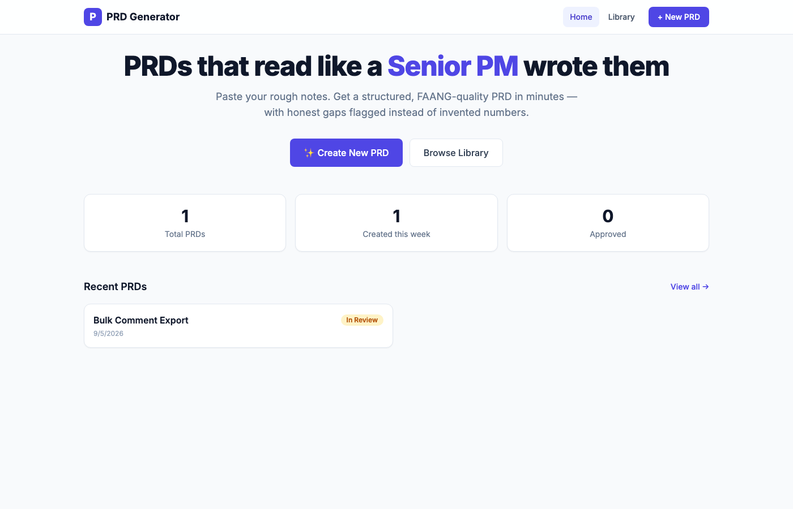
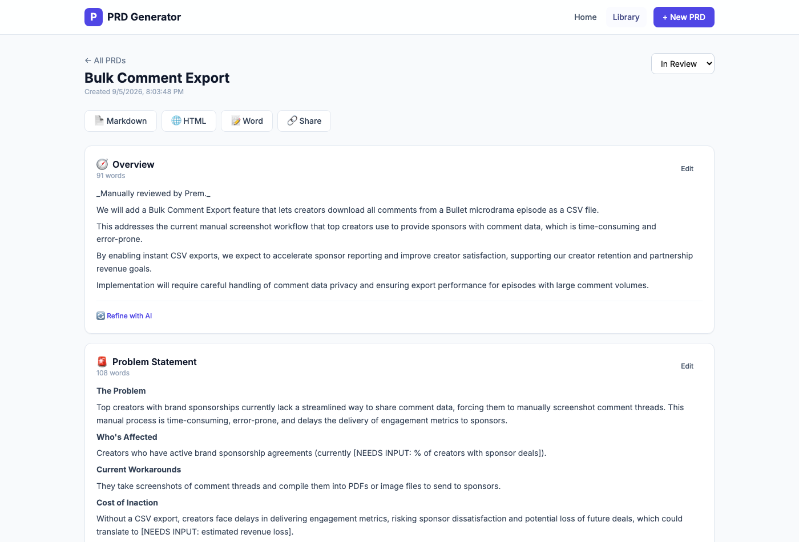

# PRD Generator

Turn rough product notes into a structured, FAANG-quality PRD — with honest
gaps flagged instead of invented numbers.



## Why this exists

Most "AI PRD generator" demos happily invent metrics ("12 support tickets/week",
"$50K ARR") that were never in your input, because it makes the output *look*
authoritative. This one doesn't: **Strict Mode** instructs the model to write
`[NEEDS INPUT: ...]` instead of fabricating a number, so nothing you didn't
actually say ends up looking like a fact in a doc your team will act on.

## Features

- **8-section PRD generation** (Overview, Problem, Goals & Metrics, User
  Stories, Solution, Requirements, Scope & Timeline, Risks) with live,
  section-by-section progress
- **Strict Mode** — refuses to invent metrics; flags missing data instead
- **Per-section AI refinement** — give feedback ("make the timeline more
  aggressive") and regenerate just that section
- **Status, tags, search, filter, duplicate** for managing a library of PRDs
- **Real shareable links**, backed by the server (not a fragile base64 URL)
- **Export** to Markdown, HTML, or Word
- **Rendered markdown in the viewer** — tables and bold render properly,
  not as raw `| pipe |` / `**asterisk**` syntax



## Tech stack

| Layer | Choice |
|---|---|
| Frontend | React + Vite + Tailwind CSS |
| Backend | Node.js + Express |
| AI | [Groq](https://console.groq.com) (`openai/gpt-oss-120b` / `20b`) |
| Storage | Flat-file JSON (single-user, local-first by design) |
| Word export | [`docx`](https://www.npmjs.com/package/docx) |

## Project structure

```
prd-generator/
├── server/              Express API
│   └── src/
│       ├── routes/      One file per resource (prds, generate, export, share, config)
│       ├── sections.js  PRD section definitions + prompt templates
│       ├── groqClient.js AI client with retries + friendly errors
│       ├── storage.js   Flat-file JSON persistence
│       ├── exporters.js Markdown/HTML/Word generation
│       └── static.js    Serves web/dist in production (single-service deploy)
├── web/                 React (Vite) frontend
│   └── src/
│       ├── pages/       Home, NewPrd, Library, PrdView, Shared
│       ├── components/  SectionCard, MarkdownView, Navbar, StatusBadge, Stat
│       ├── api.js        Fetch wrapper (incl. streaming generation reader)
│       └── constants.js  Shared constants (e.g. status list)
├── legacy-streamlit/    Original Streamlit prototype, kept for reference
├── prd generator.zip    "Learn to build this from scratch" tutorial bundle
└── render.yaml          One-click Render deploy blueprint
```

## Quick start

```bash
git clone https://github.com/PremDutta/prd-generator.git
cd prd-generator
npm run install:all

cp server/.env.example server/.env
# edit server/.env and set GROQ_API_KEY (free key: console.groq.com/keys)

npm run dev
```

This starts the API on `http://localhost:8787` and the frontend (proxying
`/api` to it) on `http://localhost:5180`.

### Environment variables

| Variable | Where | Required | Description |
|---|---|---|---|
| `GROQ_API_KEY` | `server/.env` | Yes | Your Groq API key |
| `PORT` | `server/.env` | No | API port (default `8787`) |

### Scripts (repo root)

| Command | What it does |
|---|---|
| `npm run install:all` | Installs both `server/` and `web/` dependencies |
| `npm run dev` | Runs the API and the Vite dev server together |
| `npm run build` | Builds the frontend for production |
| `npm start` | Builds the frontend, then serves everything from one process |

## Deployment

The Express server can serve the built frontend directly, so the whole app
deploys as **one service with one URL**.

1. Push this repo to GitHub (already done if you're reading this on GitHub)
2. On [Render](https://render.com): **New +** → **Blueprint** → select this repo
   — it reads `render.yaml` automatically
3. Paste your `GROQ_API_KEY` when prompted
4. Deploy — you'll get a live URL in a couple of minutes

**Free-tier caveats:** the service sleeps after 15 minutes idle (cold start
~30-50s on the next visit), and the flat-file storage lives on ephemeral disk,
so the PRD library isn't guaranteed to survive a redeploy. Fine for sharing a
demo link; swap in Postgres (Render has a free tier) if you need PRDs to
persist permanently.

## API overview

| Method | Path | Purpose |
|---|---|---|
| `GET` | `/api/config` | Available models, section list, key status |
| `GET` | `/api/prds` | List PRDs (`?search=`, `?status=`) |
| `GET` | `/api/prds/:id` | Get one PRD |
| `PATCH` | `/api/prds/:id` | Update fields (status, tags, content) |
| `POST` | `/api/prds/:id/duplicate` | Duplicate a PRD |
| `DELETE` | `/api/prds/:id` | Delete a PRD |
| `POST` | `/api/prds/generate` | Generate a new PRD (streamed NDJSON progress) |
| `POST` | `/api/prds/:id/sections/:sectionId/regenerate` | Refine one section with feedback |
| `GET` | `/api/prds/:id/export/:format` | Export as `markdown` / `html` / `docx` |
| `POST` | `/api/prds/:id/share` | Create/get a share link |
| `GET` | `/api/shared/:shareId` | Read a shared PRD (public) |
| `POST` | `/api/shared/:shareId/import` | Import a shared PRD into your library |

## Known limitations / roadmap

- **Single-user, local-first storage** — no auth, no multi-user support. Fine
  for one PM's personal tool; would need a real database + auth for a team.
- **No version history** — editing a section overwrites it; nothing to
  restore from yet.
- No PDF export (HTML export prints cleanly to PDF from a browser in the
  meantime).

## License

MIT — see [LICENSE](LICENSE).
